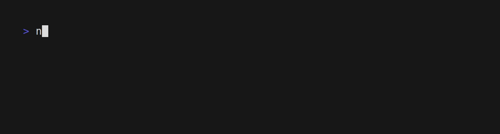

# Note

Manage your notes without ever leaving the command line!

## Installation

Install dependencies:
- [lowdown](https://kristaps.bsd.lv/lowdown/)
- [rsync](https://rsync.samba.org/)

Then clone this repo, and 'sudo make install'.

Make sure that you have exported the 'EDITOR' environmental variable.

To enable syncing, export the remote location as the 'NOTE_REMOTE' environmental variable.

## Usage

note [COMMAND] [ARGS]

### Commands

- n             Create a brand new note
- f [string]    Search all notes for [string]
- d [number]    Delete note [number]
- v [number]    View note [number]
- s             Pull notes down from remote
- b             Backup local notes to remote
- e [number]    Edit note [number]
- l             List notes
- h             Print help message

## Uninstallation

'sudo make uninstall'

## License

Note is licensed under the BSD 3-Clause License. See LICENSE file or the [Open Source Initiative](https://opensource.org/license/bsd-3-clause/) for the full text of the license.
